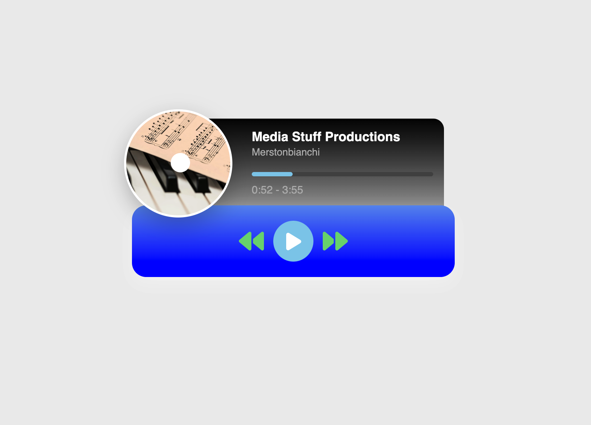

# Music Player

Music palyer as fully functional web application written in pure JavaScript. This example demonstrates how to create a music player with basic functionality such as play, pause, next and previous track, and display of the current song's title and artist.


## Installation

1. Clone the repository:
   ```bash
   git clone https://github.com/tpreisig/music-player.git
   ```
2. Navigate to the project directory:
   ```bash
   cd music-player
   ```
3. : Start the application
   ```bash
   open index.html
   ```

## License

This project is licensed under the MIT License - see the [LICENSE](LICENSE) file for details.

## Screenshots



## Contact

Maintained by tpreisig - feel free to reach out!
